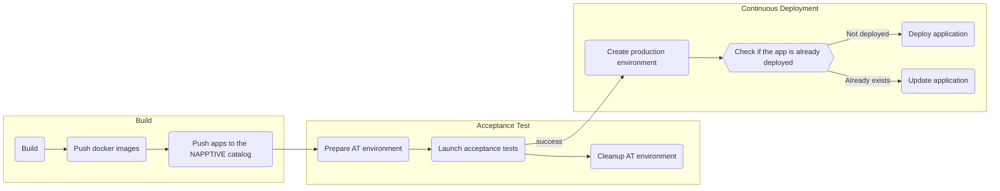

# An example of a NodeJS application in NAPPTIVE

This repository contains a simple NodeJS application that provides an API to manage a list of TODO items. The purpose of this application is to understand how the Napptive platform can be leveraged in the following aspects:

* Run acceptance tests for applications and implement a CI/CD pipeline.
* Use the catalog to store the application definition so that it can be deployed in other environments.
* Deploy the application into a production-like environment.

## The application

The provided NodeJS applications offers a simple API for a microservice that manages a list of todo items. In order to simplify as much its definition, the application stores data in-memory, but a database backend may be added in future releases. In terms of frameworks, the app uses [Express](https://expressjs.com/) to create the REST API, [Jasmine](https://jasmine.github.io/) to run the unit and integration tests, and [newman](https://github.com/postmanlabs/newman) to run the acceptance tests. The CI/CD pipeline is written using different NAPPTIVE GitHub actions to [push applications to the catalog](https://github.com/napptive-actions/catalog-push-action), [deploy applications from the catalog](https://github.com/napptive-actions/catalog-deploy-action), and [execute playground commands](https://github.com/napptive-actions/playground-github-action).

The following REST endpoints are provided:

```
GET /healthz
GET /todos
POST /todos/add?item=<text>
POST /todos/done?id=<item_identifier>
POST /todos/remove?id=<item_identifier>
```

The /healthz endpoint returns 200 OK on every call, and can be used to illustrate how to setup status monitoring hooks. The other endpoints provide a list of all items (`/todos`), an endpoint to add a new item (`/todos/add`), another to mark an item as done (`/todos/done`), and finally an endpoint to remove a single item from the list (`/todos/remove`).

## The CI/CD pipeline

In this example, we have implemented a basic CI/CD pipeline that covers the standard steps:



First, the pipeline builds the code and run unit test agains the [todo.js](todo/todos.js) implementation of the in-memory list, and integration tests against the [api.js](routes/api.js) endpoints. After that, the docker images are generated generated and uploaded to `<target_docker_registry>/example-app-nodejs-api:<version>` and `<target_docker_registry>/example-app-nodejs-api-at-runner:<version>`. In the same way, the application definition is uploaded to the NAPPTIVE catalog storing the application as `<playground_account_name>/example-app-nodejs:<version>` and `<playground_account_name>/example-app-nodejs-at:<version>` respectively.

Once the docker image is built and the revision is available on the catalog, the acceptance test phase starts. For that, the pipeline creates a new fresh environment named `<playground_account_name>/todo-at-<GITHUB_RUN_ID>`. The application and the acceptance test runner are launched, and the job waits for the runner to retrieve the results. The acceptance test environment is then removed as it will no longer be used.

Finally, if the tests are successful, we create the production environment `<playground_account_name>/todo-app-prod` and check if the application is already deployed. If it does not exists, we deploy the application from the catalog. Otherwise, we patch the component version to use the new version.

## How to run this example

**Before you start**: The following instructions work without changes on the PRO and higher subscription levels. If you are using a FREE account, follow the [extra instructions](./extra_instructions.md) to set up the pipeline. If you want to try the PRO subscription, create an account using [this link](https://playground.napptive.dev/login?&campaign_source=github) if needed, and use code **"KICKASSDEV"** during the [subscription process](https://docs.napptive.com/Subscription.html#using-discount-coupon) to get 12 months for free.

1. Navigate to [https://github.com/napptive/example-app-nodejs](https://github.com/napptive/example-app-nodejs) and fork the example to your own repository by clicking on the `Fork` icon on the top right of the GitHub page.
2. Generate a [Personal Access Token](https://docs.napptive.com/guides/04.5.Using_personal_access_tokens.html) and save the results in a secret called `PLAYGROUND_PAT`. Make sure the repository can access the value of the secret in case you are using an organization one. If you don't have a playground account, [get started for free](https://playground.napptive.dev) by signing up with your GitHub account.
3. Generate Docker [Access Tokens](https://docs.docker.com/docker-hub/access-tokens/) and store the resulting values in two secrets: `DOCKER_HUB_USER` and `DOCKER_HUB_TOKEN`.
4. Edit [.github/workflows/deploy-app.yml](.github/workflows/deploy-app.yml) and modify the value of `TARGET_DOCKER_REGISTRY` with your docker username.
5. Commit your changes to your repository, accept the PR if you are using this approach, and check the triggered action.

Once the action has been executed, you can connect to the [NAPPTIVE Playground](https://playground.napptive.dev) and you will see your application running. First, select the `todo-app-prod` environment on the top left selector, and click on the `example-app-nodejs` application. After that, expand the application and click on the endpoint link to receive the welcome message.

Alternatively, you can open the application endpoint with the CLI by executing:

```
playground use <playground_account_name>/todo-app-prod
playground apps open example-app-nodejs
```

Now, try editing [server.js](server.js) and changing the welcome message, and increasing the [version](version) file.

```js
// Change this line to easily check that the running application has changed.
app.get('/', (req, res) => {
  res.send('Hello World!')
})
```

Commit the changes, and you will see the updated app running after the GitHub actions pipeline is executed.

## License

 Copyright 2022 Napptive

 Licensed under the Apache License, Version 2.0 (the "License");
 you may not use this file except in compliance with the License.
 You may obtain a copy of the License at

      https://www.apache.org/licenses/LICENSE-2.0

 Unless required by applicable law or agreed to in writing, software
 distributed under the License is distributed on an "AS IS" BASIS,
 WITHOUT WARRANTIES OR CONDITIONS OF ANY KIND, either express or implied.
 See the License for the specific language governing permissions and
 limitations under the License.